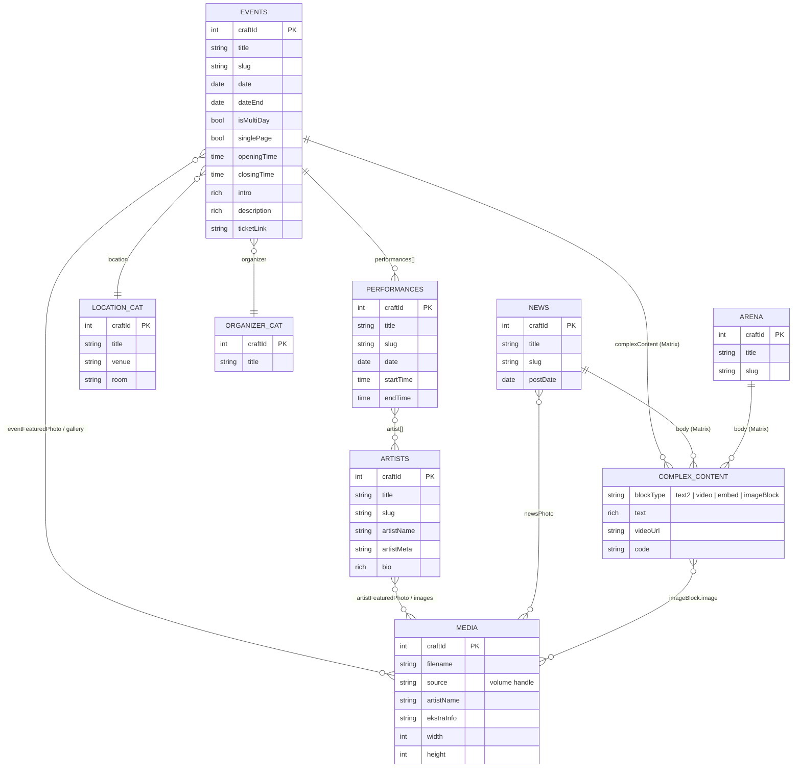
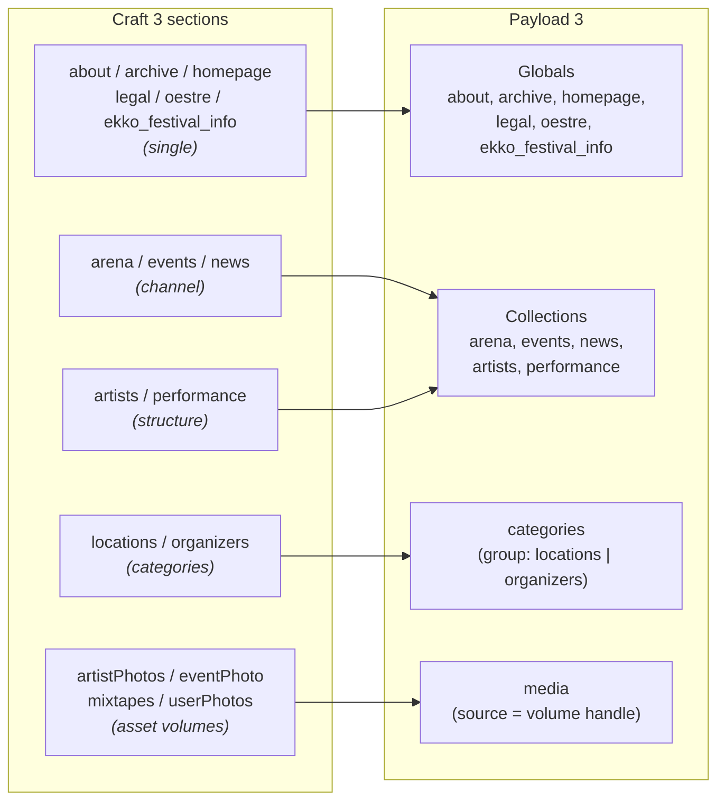
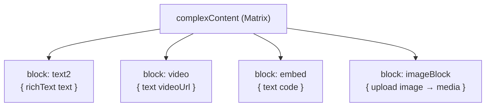

# EKKO / Østre content data model

The model is shared by the Craft 3 source and the Payload target (the migration
preserves it). It centers on **events** that link **performances** and **artists**,
classified by **category** taxonomies (locations, organizers), with rich **Matrix**
body content and **assets** from four media volumes. Two locales: `en`, `nb`.

## Entity-relationship diagram

## Section map (Craft → Payload)

## Field-type mapping

| Craft field | Count | Payload |
|---|---|---|
| PlainText | 38 | `text` / `textarea` |
| Redactor | 18 | `richText` (lexical) |
| Lightswitch | 12 | `checkbox` |
| Date | 11 | `date` |
| Assets | 11 | `upload` → `media` |
| Entries | 9 | `relationship` |
| Matrix | 8 | `blocks` |
| Dropdown | 3 | `select` |
| Color | 3 | `text` (hex) |
| Categories | 2 | `relationship` → `categories` |
| Tags | 1 | `relationship` → `tags` |
| Link | 1 | `group { label, url }` |
| Preparse | 1 | dropped (derived) |

## The `complexContent` Matrix → Payload blocks

## Relationship cheat-sheet

- **events.performances[]** → performance entries (one event → many performances)
- **performance.artist[]** → artist entries (many-to-many)
- **events.location** → category (locations group; carries `venue`, `room`)
- **events.organizer** → category (organizers group)
- **\*.featuredPhoto / gallery / images** → `media` (upload, hasMany)
- **structures** (`artists`, `performance`) keep tree order via `order` +
  `parentCraftId` on each Payload doc.

> Diagrams render on GitHub and in the VS Code Markdown preview (Mermaid).
